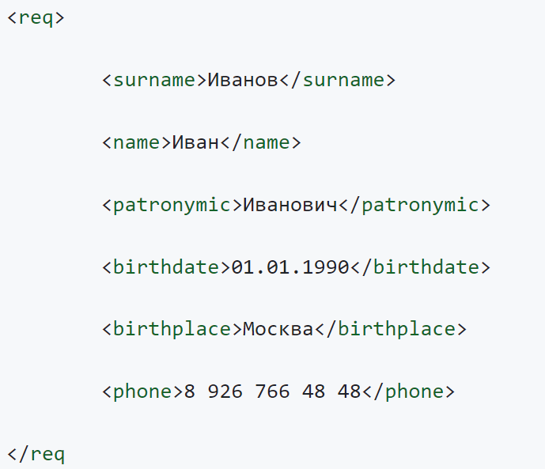
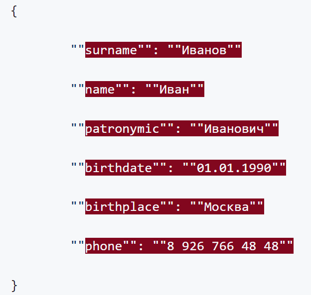

# web-smnr5
#Домашнее задание
##Задание 1
Проверьте следующий XML на Well formed:

###Ответ
В строке 15 отсутствует неверено записан закрывающий тег req, не хватает знака больше после имени тега.

##Задание 2
Проверьте следующий JSON на Well formed:

###Ответ
Неправильный синтаксис - ключи и значения записываются в одинарные двойные кавычки, а не в двойные; данные должны записываться через запятую, в строках 2-6.
